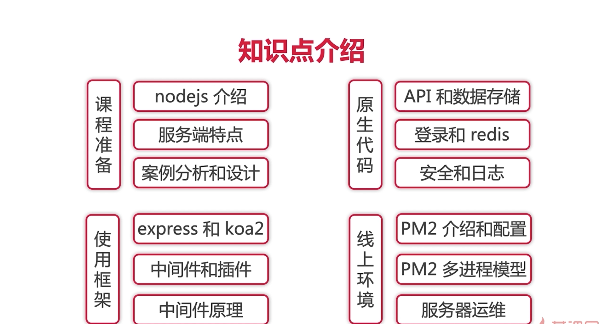

### `课程介绍`

**知识点介绍**




**架构图**


### `nodejs安装`

```
node多版本安装--nvm

nvm use [version]
```


### `ECMAScript、javascript 和 nodejs`

```
ECMAScript是语法规范
	包含了文法、语义、运行时三个方面，但不能DOM操作，BOM操作，事件绑定，Ajax，http请求，文件操作
javascript是ECMAScript + web API
nodejs是ECMAScript + nodejs API
```


### `server开发和前端开发的区别(重点)`

```
+ 稳定性
  + 使用PM2做进程守候，防止server挂掉，开发时使用nodemon
+ 考虑内存和CPU
  + 使用stream写日志，redis存session
+ 日志记录
+ 安全
+ 集群和服务拆分
```


### `技术方案`

+ 数据如何存储（数据库）
  + 博客
  + 用户
+ 如何与前端对接，即接口设计，类似`rap2.taobao.com`